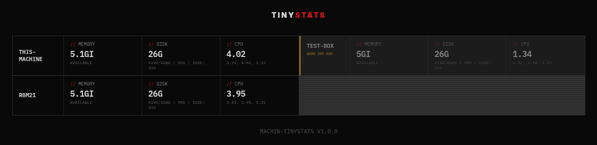

# TinyStats

<p align="center">
  <b>Ultra-lightweight system metrics for resource-constrained devices — 79 KB binary, 760 KB RSS</b><br/>
  Real-time multi-machine monitoring + remotecmd sidecar, built in Machin/MFL.
</p>

<p align="center">
  
  
  
  
</p>

## Why?

Most monitoring tools are heavy. Netdata uses 50-150 MB RSS. Datadog's agent is 100+ MB. Even lightweight alternatives assume you have gigabytes of RAM to spare.

**TinyStats is for machines where every megabyte counts:**

- Routers and OpenWrt devices (128 MB RAM)
- Raspberry Pi Zero and other SBCs (512 MB RAM)
- Cheap VPS fleet ($2/mo instances with 512 MB RAM)
- Edge computing devices and IoT gateways
- Containers where agent overhead matters

| | Netdata | Datadog Agent | **TinyStats** |
|---|---|---|---|
| Binary size | 25 MB | 100+ MB | **79 KB** |
| RSS (resident memory) | 50-150 MB | 100-300 MB | **760 KB** |
| Runtime | bundled | bundled | none (pure C) |
| Dependencies | libc, libm, libuv | libc, many | libc, libm |
| History/alerts | yes | yes | no (live only) |
| Remote management | no | no | yes (sidecar) |

TinyStats trades history and alerts for **100× lower resource usage**. It shows you what's happening right now across all your machines, and lets you remotely manage them — without paying the memory tax.

> Originally a rewrite of [MiniStats](https://github.com/javimosch/ministats) (Bun/TypeScript, 99 MB binary). Same architecture, 1300× smaller.

## Screenshot



## Features

- Real-time metrics via WebSocket (CPU load, memory, disk, inodes)
- Centralized dashboard (multi-machine, 2-column grid)
- Zero-config install (single static binary)
- Stale client detection and pruning
- HTTP POST fallback for clients behind firewalls
- IBM Plex Mono + scanline overlay UI
- **Remotecmd sidecar** — provision remote shell access without SSH (v1.1.0+)

## Quick Start

### 1. Download

```bash
curl -fsSL https://raw.githubusercontent.com/javimosch/machin-tinystats/master/scripts/install.sh | bash
```

### 2. Start Server

```bash
tinystats server --port 9094
```

Open → http://localhost:9094

### 3. Connect Machines

```bash
tinystats client --name my-machine --server http://YOUR_SERVER_IP:9094
```

Done. Metrics appear instantly.

## Commands

```bash
tinystats server --port <port>                    # start the dashboard server
tinystats client --name <name> --server <url>     # connect a machine
tinystats sidecar --port <port>                   # start the remotecmd pairing sidecar (default: 9096)
tinystats -v                                      # show version
tinystats help                                    # usage
```

## Leak guard (systemd)

TinyStats sits at ~4 MB RSS. If it ever climbs past that, something is wrong.
`scripts/systemd/` holds a drop-in that caps the process and recycles it daily:

```bash
sudo mkdir -p /etc/systemd/system/tinystats-client.service.d
sudo cp scripts/systemd/tinystats-client.service.d-zz-watchdog.conf \
  /etc/systemd/system/tinystats-client.service.d/zz-watchdog.conf
sudo systemctl daemon-reload && sudo systemctl restart tinystats-client
```

`MemoryMax=64M` (128M for the server) lets the cgroup OOM-kill a runaway long
before it costs the host anything, and `RuntimeMaxSec=86400` recycles the unit
every 24h as a backstop for a leak too slow to trip the cap. Both rely on
`Restart=always`, which the shipped units already set. Requires systemd 229+
and the cgroup memory controller.

For hosts running the client under cron instead of systemd, `scripts/tinystats-watchdog.sh`
applies the same two thresholds from userspace and respawns the client if it is
not running. Run it every 5 minutes from cron.

## Remotecmd Sidecar (v1.1.0+)

The sidecar is a tiny HTTP endpoint (`POST /__rcmd/pair`) that provisions a [remotecmd](https://github.com/javimosch/remotecmd) connection on the machine — no SSH access needed. This lets you remotely manage tinystats clients behind firewalls or NAT.

### How it works

```
1. rcmd pair listen --name <target> --require-activation-key  → generates pair code
2. POST /__rcmd/pair {relayUrl, code, activationKey, name}    → sidecar downloads rcmd, starts daemon
3. rcmd exec --target <target> --cmd 'hostname'               → remote shell access
```

### Start the sidecar

```bash
# Default port 9096, allowlist *.intrane.fr
tinystats sidecar --port 9096

# Custom allowlist (comma-separated patterns)
RCMD_ALLOWED_RELAYS="*.intrane.fr,92.113.145.178" tinystats sidecar --port 9096
```

### Security

| Layer | What | Where |
|---|---|---|
| Relay URL allowlist | `RCMD_ALLOWED_RELAYS` env var (default `*.intrane.fr`) | sidecar |
| Activation key | enforced by the relay | relay |
| Pair code | single-use, 300s TTL | relay |

The sidecar downloads the `rcmd` binary from GitHub releases (cached in `$TMPDIR/.rcmd-cache/`), runs `pair accept`, then spawns the daemon detached — it survives the HTTP request and runs in the background.

## Build from Source

Requires [Machin](https://github.com/javimosch/machin) installed (`go install` or `make install` from the machin repo):

```bash
./build.sh
```

This encodes the MFL source (`framework/machweb.src` + `framework/ws.src` + `src/*.src`) to a single `.mfl` and compiles it to a native binary.

## Architecture

```
[ client ] --->\
[ client ] ----->  [ server ] ---> Web UI (WebSocket)
[ client ] --->/
```

- Clients collect metrics every 5s via `free`, `df`, `df -i`, `uptime`
- Clients POST JSON to `/api/report` (HTTP) — the server broadcasts to dashboards
- Dashboards connect via WebSocket at `/ws` and receive the full state on every update
- A single hub goroutine owns all state (dashboards map + clients map) — race-free by design
- No database, no persistence — just what's happening right now

## How it works

The server uses Machin's `machweb` framework (HTTP server) + `ws` framework (WebSocket RFC 6455 implementation). Both are pure MFL — no external libraries. The WebSocket codec parses and builds frames with byte-level operations (`byte_at`, `bytes_concat`, XOR unmasking).

The client uses `http_request()` (Machin's built-in HTTP client) to POST metrics as JSON. No WebSocket client needed — simple HTTP POST, which also works behind firewalls that block WebSocket upgrades.

## Philosophy

**Trade features for footprint.** TinyStats deliberately doesn't do history, alerts, log aggregation, APM, or tracing. What it does is run on machines where nothing else fits — and give you a live view plus remote shell access when you need to fix something.

If you need long-term metrics, alerts, and analytics → use Prometheus + Grafana or Netdata (if your machines have the RAM). If you need to see what's happening right now on devices that can't spare 100 MB → use TinyStats.

## Why Machin?

Machin compiles MFL to C, then to native code. No runtime, no garbage collector, no bundled interpreter. The binary is just C compiled with `cc -O2`. That's why it's 79 KB instead of 99 MB — there's nothing in the binary except the actual program logic and the libc calls it needs.

## Contributing

PRs welcome. Keep it simple.

## License

MIT
